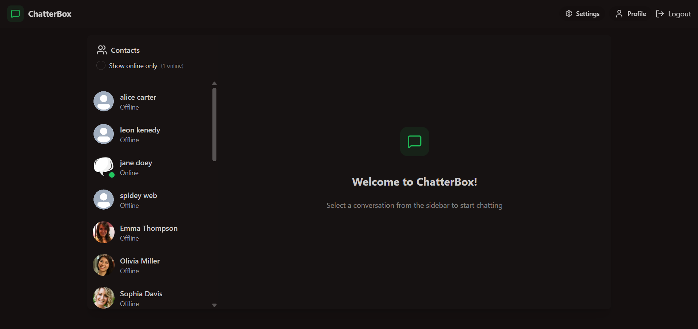
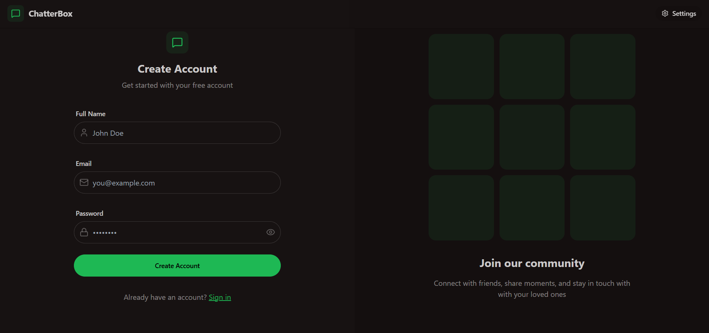
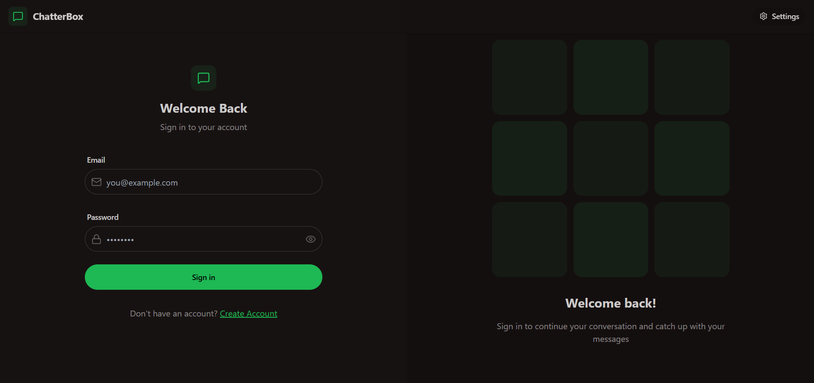
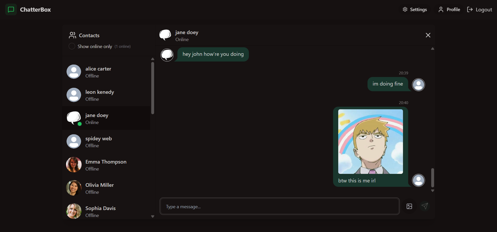
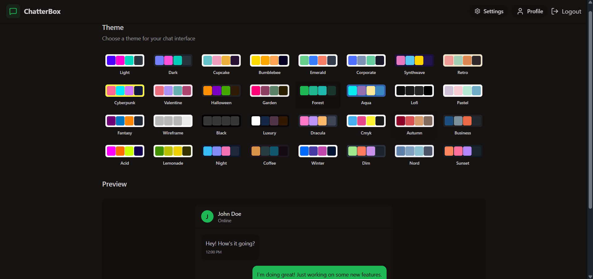
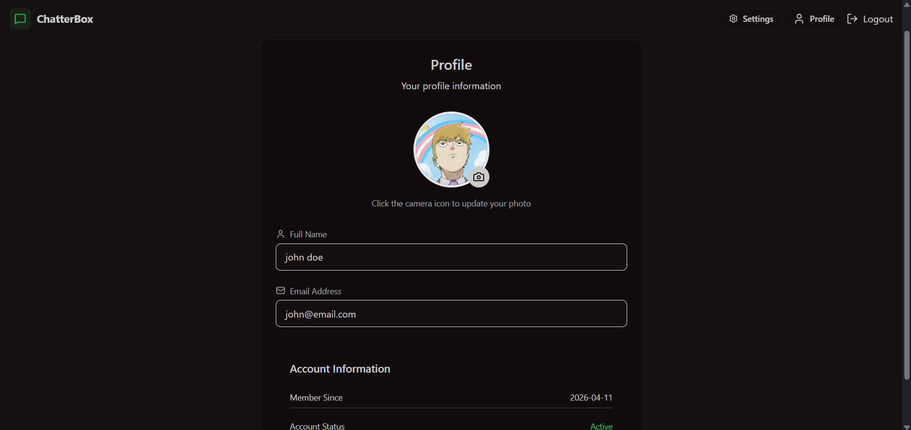

# Realtime Chat App
Check out my website [here](https://realtime-chat-app-9q31.onrender.com/).



## Overview
RT chat app is real time messaging application. This is fullstack application allows users to login securely and message their friends and family instantly. It features online/offline status that lets users know you are available, also has modern and intuitive UI built using react and tailwindcss and much more.

## Features
- Authentication and authorization using JWT tokens
- Real time messaging and online/offline status tracking using socket.io
- Global state management using zustand
- Robust error handling both server and on the client
- Stylish themes using daisyUI
- Mobile friendly design using tailwind css
- Cloudinary integration for storing images and other files
- Alert notification using react hot toast.

## Screenshots
- Register

- Login

- Chat space

- Themes

- Profile


## Technologies used
- **Frontend:**
  - React
  - TailwindCSS + DaisyUI
- **Backend:**
  - NodeJS
  - Express
- **Database:**
  - MongoDB
  - Mongoose(ORM)
- **Additional Packages:**
  - Socket.io(Server & Client)
  - JWT tokens

## Installation
1. Clone the repository
2. Setup .env file
    ```js
    MONGODB_URI=...
    PORT=5001
    JWT_TOKEN=...
    CLOUDINARY_CLOUD_NAME=...
    CLOUDINARY_API_KEY=...
    CLOUDINARY_API_SECRET=...
    NODE_ENV=development
    ```

2. Run the below commands

    - Build the app
      ```shell
      npm run build
      ```
    - Start the app
      ```shell
      npm start
      ```
